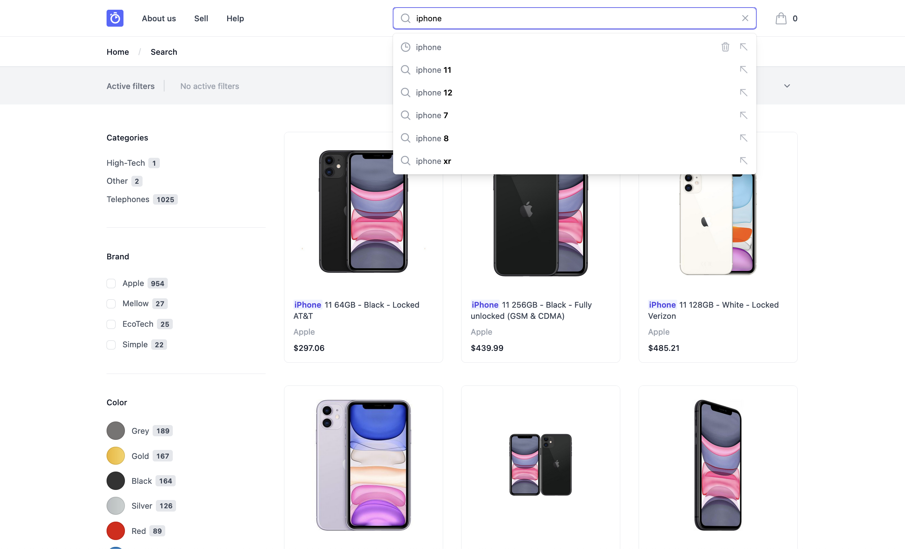

# Algolia DevCon 2022 | Storefront Demo Next.js

This project shows how to integrate a search and discovery experience into a Next.js storefront with Algolia.



## Requirements

To run this project, make sure you have [Node.js](https://nodejs.org/) and [Yarn](https://yarnpkg.com/) installed on your machine (you can use [nvm](https://github.com/nvm-sh/nvm) to control which version of Node.js to use).

## Get started

First, install the dependencies by typing the following command in your terminal:

```sh
yarn
```

Then, run the project locally:

```sh
yarn dev
open http://localhost:3000/
```

## Algolia DevCon

Algolia Devcon is an interactive 2-day developer conference dedicated to our engineering community.

At [#AlgoliaDevCon](https://twitter.com/hashtag/AlgoliaDevCon) you'll experience:
- 2 days of learning and innovation on building search and discovery experiences
- 15+ sessions, workshops and live coding sessions
- 500+ like-minded developers in the Algolia community

Check out [algolia.com/devcon](https://www.algolia.com/devcon/) for more info.

>**Disclaimer:** The product dataset presented in this demo is the property of [BackMarket.com](https://www.backmarket.com/) and has been kindly lent to Algolia for demo purposes only. No unauthorized use can be made of it for any purpose without explicit consent from [BackMarket.com](https://www.backmarket.com/).
